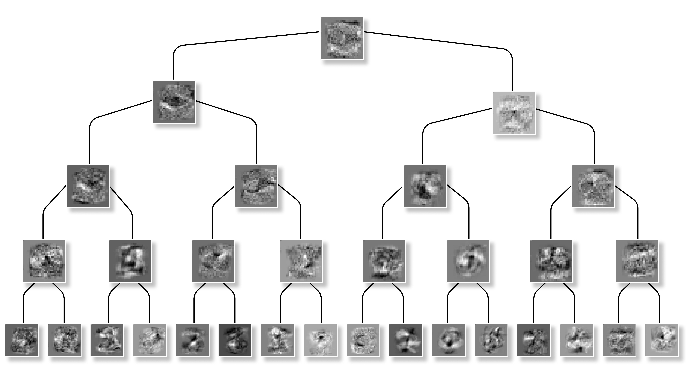
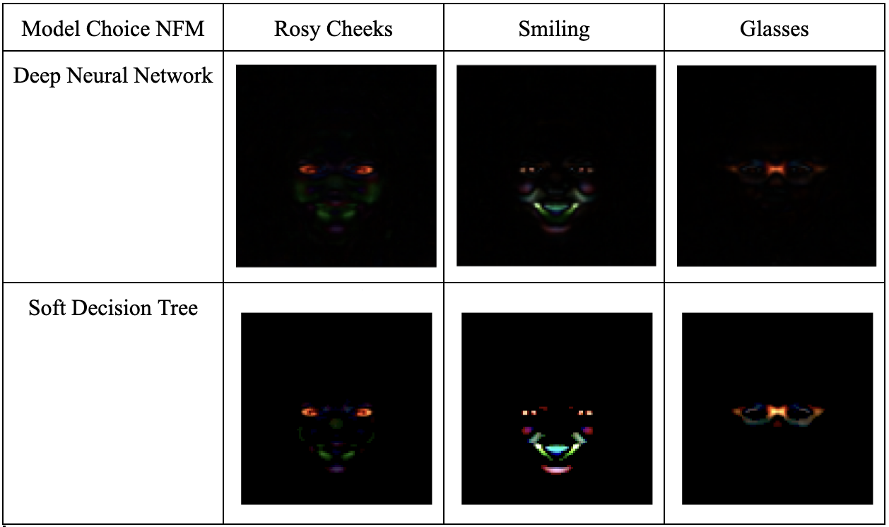
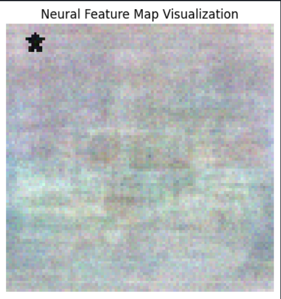

---
# Feel free to add content and custom Front Matter to this file.
# To modify the layout, see https://jekyllrb.com/docs/themes/#overriding-theme-defaults

layout: default
usemathjax: true
---

## Introduction 🗒️
---
Machine learning is in everything nowadays. It has revolutionized almost everything it has touched, from complex medical procedures, to netflix recommendations, to the path the chips you bought get to the store. Welcome to our journey through the transformative world of machine learning, a branch of artificial intelligence that teaches computers to learn from data, much like humans do from experience. At the forefront of this exciting adventure is the concept of feature learning—a cutting-edge technique that allows computers to automatically identify the most important pieces of information from the data they’re given. Coupled with this is our focus on soft decision trees, an innovative twist on traditional decision-making models, which are designed to be more flexible and intuitive, much like choosing a path based on probabilities rather than a simple yes or no answer.

Central to our exploration are neural networks, sophisticated algorithms modeled after the human brain's architecture, enabling machines to think and learn with astonishing depth and complexity. These networks are the backbone of our ability to process and interpret vast amounts of data, making sense of the world in ways that were previously unimaginable. They are able to solve complex tasks like driving cars, surgery, and much more; yet their inner workings still mystify us. How they learn such important features are a mystery only beginning to be solved. So, as we delve into these concepts, we aim to make this cutting-edge technology understandable and accessible, shedding light on how it's transforming our world and why it's an exciting time to be at the intersection of technology and discovery. Join us as we embark on this enlightening journey, unraveling the mysteries of machine learning, feature learning, and making them understandable through soft decision trees.

## What's feature learning and why do we care about it? 🔎
---

At its core, feature learning is a revolutionary process within machine learning that automates the identification of the most relevant characteristics or "features" in a dataset. Think of it as teaching a computer to find and focus on the most important details in a vast landscape of information.

Imagine you're teaching someone to differentiate between a cat and a dog. Traditionally, you might start by pointing out key features: 'Cats usually have shorter noses, and dogs come in a wider variety of sizes.' This is akin to the older methods in machine learning, where experts had to painstakingly identify and input these distinguishing features into the computer. However, with feature learning, the approach is fundamentally different and far more intuitive. Unlike these traditional methods where we manually specify what to look for, in feature learning, the computer itself learns to identify the distinguishing features between cats and dogs. It does this through a process of adjusting different 'weights' and 'biases' within neural networks, essentially fine-tuning its own internal parameters until it can accurately tell cats and dogs apart, all on its own. This means we don't have to tell the computer what features are important; it discerns and learns the most crucial aspects through its own experience, much like a child learning to identify animals. Similarly to a child, it might even find important things that we missed, which is a part of what makes it so powerful.

Yet, like mentioned before, we are only beginning to understand what how they learn features so well and what features they are learning. That is why it's crucial for us to explore avenues to understand them better. We can't have a computer making important decision such as driving our children to school, performing brain surgery, etc. if we don't know why they make the choices they make. This is what we explored in our first quarter project. Through the use of the Neural Feature Matrix (NFM), we can capture the features learned back onto the input data. We can also use this to understand features between different layers. The intricate details about the NFM are included below. Otherwise, it's importance is simply to quantify and give us a better understanding of those features mentioned previously.

Neural Feature Matrix Details ⤵️

 
Let \( f: \mathbb{R}^d \rightarrow \mathbb{R} \) denote a fully connected network with \( L \) hidden layers for \( L > 1 \), weight matrices \( \{W_i\}_{i=1}^{L+1} \), and elementwise activation function \( \phi \) of the form

\[
f(x) = W_{L+1}h_L(x) ; \quad h_e(x) = \phi(W_eh_{e-1}(x)) \text{ for } e \in \{2, \ldots, L\}
\]

with \( h_1(x) = x \). We refer to the terms \( h_i(x) \) as the <b>features</b> at layer \( i \). We can characterize how features \( h_{i+1}(x) \) are constructed by understanding how \( W_i \) scales and rotates elements of \( h_i(x) \). These scaling and rotation quantities are recovered mathematically from the eigenvalues and eigenvectors of the matrix \( W_i^T W_i \), which is the NFM at layer \( i \). Hence, to characterize how features are updated in any layer of a trained neural network, it is sufficient to characterize how the corresponding layer’s NFM is constructed. Before mathematically stating how such NFMs are built, we connect NFM construction to the following intuitive procedure for selecting features.

Given any predictor, a natural approach for identifying important features is to rank them by the magnitude of change in prediction upon perturbation. When considering infinitesimally small feature perturbations on real-valued predictors, this approach is mathematically equivalent to computing the magnitude of the derivative of the predictor output with respect to each feature. These magnitudes are computed by the gradient outer product of the predictor given by \( (\nabla f(x))(\nabla f(x))^T \) where \( \nabla f(x) \) is the gradient of a predictor, \( f \), at a point \( x \).

Our main insight, the <b>Deep Neural Feature Ansatz</b>, is that deep networks learn features by implementing the above approach for feature selection. Mathematically stated, we posit that the NFM of any layer of a trained network is proportional to the average gradient outer product of the network taken with respect to the input to this layer. In particular, let \( W_i \) denote the weights of layer \( i \) of a deep, nonlinear fully connected neural network, \( f \). Given a sample \( x \), let \( h_i(x) \) denote the input into layer \( i \) of the network, and let \( f_i \) denote the sub-network of \( f \) operating on \( h_i(x) \). Suppose that \( f \) is trained on \( n \) samples \( \{(x_p, y_p)\}_{p=1}^n \). Then throughout training,

\[
W_i^T W_i \approx \frac{1}{n} \sum_{p=1}^n \nabla f_i(h_i(x_p)) \nabla f_i(h_i(x_p))^T ;
\]

where \( \nabla f_i(h_i(x_p)) \) denotes the gradient of \( f_i \) with respect to \( h_i(x_p) \). This is known as the <b>Deep Neural Feature Ansatz</b>. During our first quarterp project we verified that this ansatz holds when using gradient descent to layer-wise train (1) ensembles of deep fully connected networks and (2) deep fully connected networks with the trainable layer initialized at zero.

---

## How do we know what a "good" feature is? 👍
---

In the context of neural networks and the concept of a neural feature matrix, a "good" feature can be understood as one that significantly contributes to the network's ability to make accurate predictions or classifications. Essentially, a good feature is one that helps to reduce uncertainty or increase the discriminative power of the model. Within a neural feature matrix, which represents the learned features or representations at various layers of a neural network, a good feature is one that captures essential, underlying patterns in the data that are relevant to the task at hand. These features should ideally be invariant to irrelevant variations (such as lighting changes in image recognition, or background noise in voice recognition) and sensitive to the distinctions the model aims to learn. The effectiveness of a feature is often evaluated based on its impact on the model's performance metrics, such as accuracy, precision, recall, or the area under the ROC curve. In our models, we utilize image data, which allows us to clearly visualize the important features learned from our model. In summary, a good feature within the neural feature matrix context is one that enhances the neural network's learning capability, enabling it to extract and leverage meaningful information from the input data for better decision-making or prediction outcomes.

## Why decision trees? and why are they "soft"? 🍦
---

Decision trees have long been valued in machine learning for their simplicity and interpretability. They mimic human decision-making processes by splitting data into branches at binary decision points, making them intuitive to understand and explain. It's like deciding if the given food is a hotdog, a simple yes or no tells us whether we possess a hotdog. This characteristic is particularly important in real-world applications where understanding the rationale behind predictions or decisions is crucial. So although Neural Networks are renowned for delivering state-of-the-art performance, especially in tasks involving complex patterns or high-dimensional data, they often act as "black boxes." As we established before, understanding the "why" behind their decisions can be challenging. If a model were deciding who to give a loan to, rent a car, or provide a surgery with, that's a decision we would want to know the "why". That's where decision trees, and specifically gradient boosted trees, come into play. These models are not only fast and capable of training quickly on large datasets but also provide the much-needed interpretability by illustrating how input features influence predictions. This makes them an attractive choice for many practical applications.

The term "soft" decision trees extends this concept further by incorporating elements of neural networks to enhance the model's flexibility and performance. Unlike traditional decision trees that make hard, binary decisions at each node, soft decision trees use probabilistic approaches, allowing for more nuanced decisions based on the likelihood of different outcomes. This softening of decisions enables the model to handle ambiguity and uncertainty more effectively, through feature learning, making it better suited for complex datasets where traditional decision trees might struggle. By blending the interpretability of decision trees with the nuanced decision-making capabilities of neural networks, soft decision trees offer a compelling solution for applications requiring both high performance and clear understanding of model decisions.

### Soft Decision Tree Architecture (The Nitty Gritty)
---
As mentioned previously, soft decision trees differ from standard decision trees in that rather than have binary splits at each non-leaf node, a soft decision tree replaces this hard split between the two leaves with a soft probabilistic decision at each node. With this, there are many ways to introduce "softness" at each split, for example using a sigmoid function at each node. However, for our use case, we decided to use a soft decision tree introduced by Nicholas Frosst and Geoffrey Hinton in their paper *Distilling a Neural Network Into a Soft Decision Tree*. To quickly summarize the soft decision tree they introduced in their paper, each inner node in the tree has a learned filter \( w_i \) and a bias \( b_i \). Instead of making a hard decision at each of the inner nodes, the inner nodes calculate the probability of an input following a certain branch. This is done by applying a sigmoid logistic function (this is what makes the tree "soft" and allows us to take the Average Gradient Outer Product (AGOP) for the DNFA) to the linear combination of input features \( x \) and the learned filter, plus the bias. Thus, the probability that we go right down the tree is \( p_i(x) = \sigma(xw_i + b_i) \), and thus going left would simply be \( 1 - p_i(x) \) where \( x \) is the set of input features, \( w_i \) is the learned filter, \( b_i \) is the bias, and \( p_i(x) \) is the outputted probability.

As for the leaf nodes, each leaf node has a learned probability distribution \( Q_l \). When an input reaches a leaf node, it is assigned a distribution over possible classes based on the parameters learned during training. In the paper, they propose two ways of outputting the predictive distribution: one using the distribution from the leaf with the greatest path probability, or averaging the distributions over all the leaves, weighted by their respective path probabilities. For our project, we chose to simply use the distribution from the leaf with the greatest path probability. In the paper, they also introduce some other things about the tree such as regularizers and others, so please feel free to look into their paper if interested.

## Our Datasets 📊
---

### MNIST 1️⃣

The MNIST dataset, short for the Modified National Institute of Standards and Technology dataset, is a classic dataset in the field of machine learning and computer vision. It consists of 70,000 grayscale images of handwritten digits (0 through 9), split into a training set of 60,000 images and a test set of 10,000 images. Each image is 28x28 pixels, providing a simple yet effective arena for testing and benchmarking image processing systems and machine learning models. Due to its simplicity and the straightforward nature of the task it presents (digit recognition), MNIST has become a staple introductory dataset for those new to machine learning and deep learning. So if a model can't perform well on MNIST, it probably won't do well on more complex tasks.

#### Results 🧪

With our MNIST dataset, we were able to replicate the original findings of the creators of the Soft Decision Tree, verifying that the results were attainable. This dataset also allowed us to verify that the Neural Feature Matrix could be computed on a SDT. Finally, it easy to understand the decision paths of the tree, with the details of each digit being clearly defined. Take a look at the tree below labeled with NFM's at each split and the decision paths of each digit.

### CelebA 🏆

The CelebA (Celebrity Attributes) dataset is a large-scale face attributes dataset designed for various tasks in computer vision, including but not limited to face recognition, face attribute prediction, and face editing & synthesis. It contains more than 200,000 celebrity images, each annotated with 40 attribute labels (such as "Smiling," "Wearing Hat," etc.) and 5 landmark locations (points on the face like the corners of the eyes and the tip of the nose). The images in CelebA cover a wide range of poses, backgrounds, and lighting conditions, making it a challenging and versatile dataset for advanced machine learning models, especially those employing deep learning techniques. 

We use CelebA as it is a great benchmark for how well the model can learn features, as the different labels (like smiling) make it immediately obvious which part of the image to pay attention to. It's also a harder task than MNIST to accomplish, so it's a better test of working on real world data that isn't as uniform and cleaned to perfection. Below is our NFM's from our first quarter project trained on a traditional Neural Network.

These Neural Feature Matrices of each classification task clearly show how the model focuses on the portions of the image which are important to the task at hand. This is what we hope for, as it's important that the model does a good job.

### STL Star ⭐

The STL-10 (Self Taught Learning 10) dataset is a rich resource for developing and benchmarking machine learning algorithms. It comprises 5,000 training images and 8,000 test images, divided into 10 pre-defined classes, with each image being a higher resolution (96x96 pixels) compared to many other standard datasets, allowing for more detailed feature extraction. In a specialized augmentation of this dataset, we introduced a black star drawn on images labeled as class 9, and a white star is drawn on all other images. This augmentation focuses the classification task not on the original content of the images but on the presence and color of the star, creating a simplified yet effective testbed for evaluating a model's ability to learn and distinguish specific, artificially introduced features. This approach strips down the complexity of image classification to a single, salient feature, enabling researchers to assess how well a model can identify and focus on relevant features for the task at hand, bypassing the distractions of the rest of the image content.

## Future Work? 🔮
---
For future work that expands on this idea, we aim to further this notion of feature learning by the Deep Neural Feature Ansatz, and investigate how features are learned in other models, namely decision trees. Although the recent excitement around machine learning has been in regards to deep neural networks (DNNs), there are lots of other models used in production, one of which being decision trees. Decision trees are also quite popular, however they get even better when paired with ensemble methods, such as XGBoost. Similar to DNNs, we know that XGBoost works quite well in lots of tasks, however we are not quite certain as to how things are being learned internally. As such, for our quarter 2 project, we will be investigating how XGBoost determines which features are important. 
